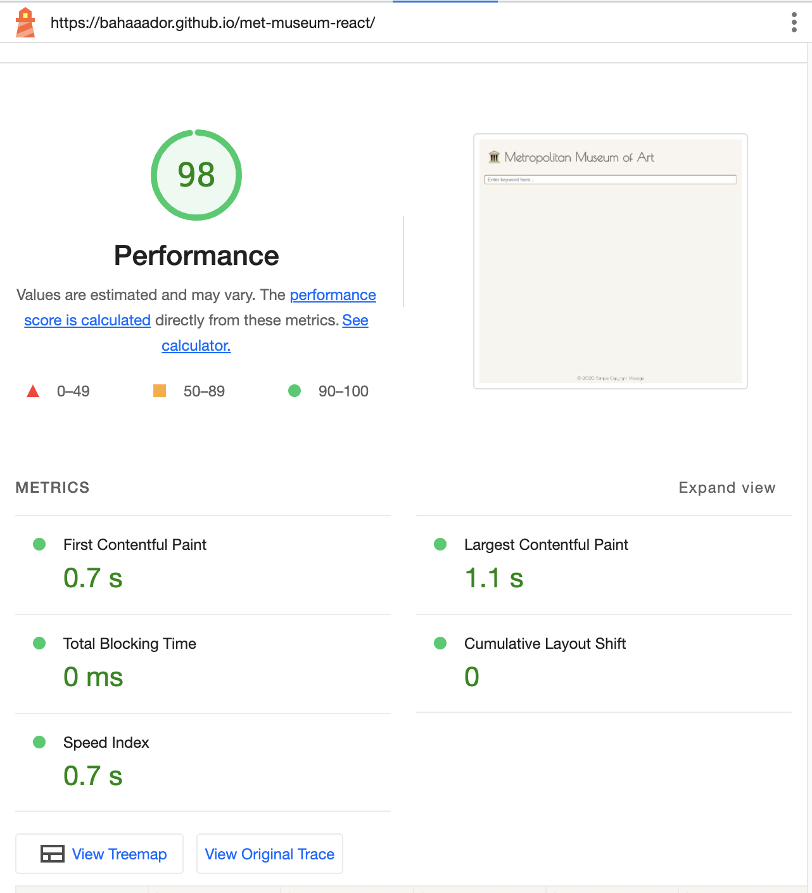
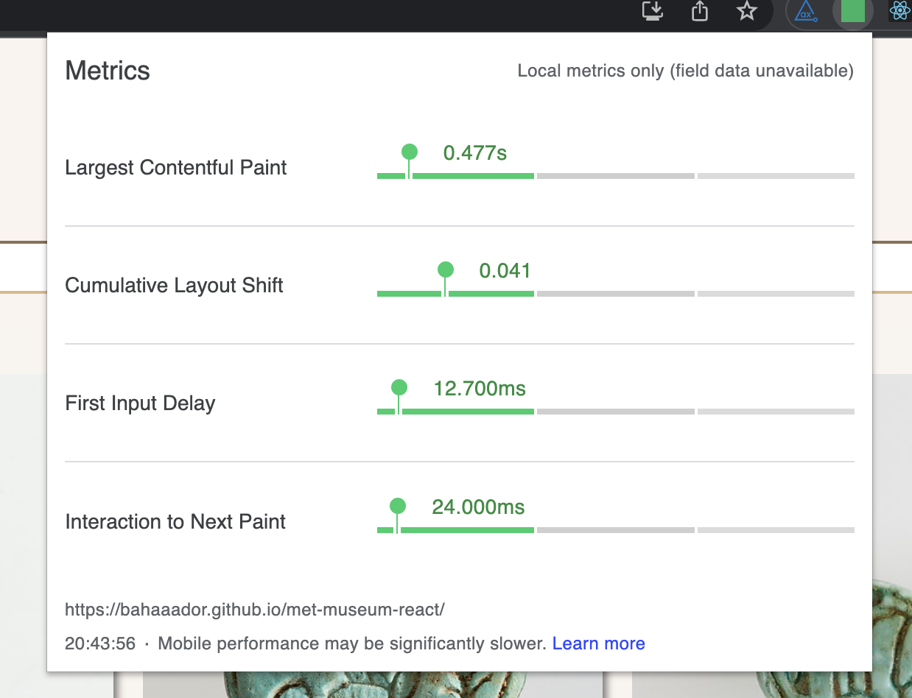
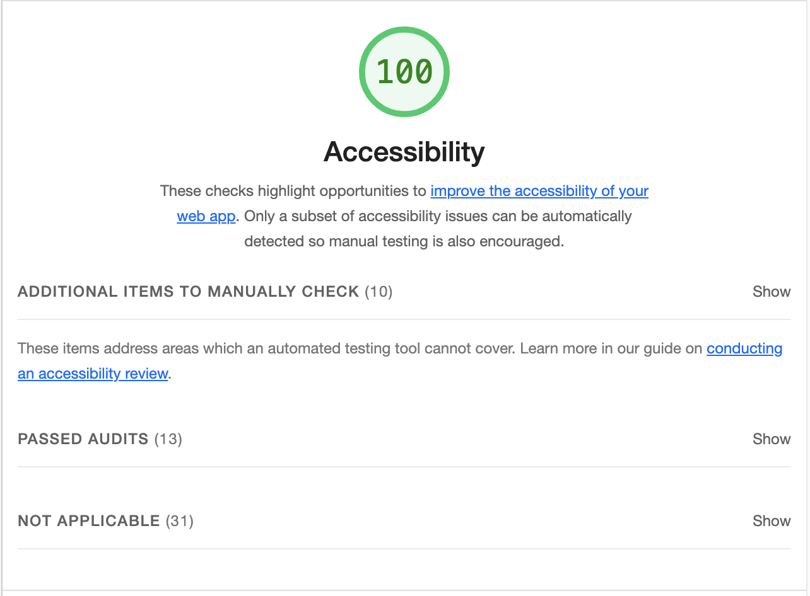
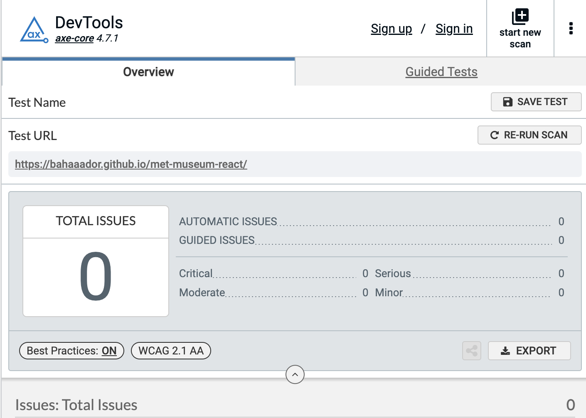

# Metropolitan Museum of Art Experience

This project is an experiment I conducted to create a simplified user experience for the Metropolitan Museum of Art (using [this](https://metmuseum.github.io/) API). The goal was to use different techniques to let the user scroll through thousandsof artifacts without degrading performance. The app mimics the lazy load feature found in modern web browsers for img tags, in addition to that each artifact's information is also lazy-loaded, optimizing network requests and rendering performance while ensuring a high level of accessibility.

You can try the app by visiting [this](https://bahaaador.github.io/met-museum-react/) link.

This application incorporates animations using the `react-spring` library, bringing dynamic and engaging visual experiences to the user. Animations are smooth and performance-optimized, ensuring they add to the user experience without sacrificing application speed or responsiveness.

The design of the application is built with responsiveness in mind. Utilizing CSS Grid and Flexbox, the layout adapts to different screen sizes, ensuring a consistent and appealing user interface across various devices. This means whether you're accessing the application on a desktop, tablet, or mobile device, you'll have an optimized user experience.

## Performance

This application utilizes the [Intersection Observer API](https://developer.mozilla.org/en-US/docs/Web/API/Intersection_Observer_API), allowing for optimized rendering of components and image loading. It only loads images that are currently in view of the user. This feature allows the user to scroll through thousands of images without the need for pagination.

The application leverages React [Suspense](https://react.dev/reference/react/Suspense) to efficiently load components, utilizing dynamic imports and automatic code splitting. This results in smaller bundle sizes, faster load times, and an overall improved user experience. With components rendered as needed, users can interact with the loaded parts of the application while the rest continues to load seamlessly in the background.

In order to optimize network requests, the [AbortSignal API](https://developer.mozilla.org/en-US/docs/Web/API/AbortSignal) is utilized to cancel invalidated ongoing requests as the user interacts with the screen. This significantly improves the application's performance.

Performance is a key focus of this project, with the application scoring 97 out of 100 on Google's Lighthouse performance evaluation.

In addition, the application meets all Web Vitals standards, ensuring a smooth, responsive, and pleasant user experience.

|                                                                     |                                                           |
| :-----------------------------------------------------------------: | :-------------------------------------------------------: |
|  |  |

## Accessibility

Accessibility is a primary concern for this project. It has achieved a 100 out of 100 score on Google's Lighthouse accessibility evaluation.

The application is screen reader friendly and its compatibility has been verified through the Axe accessibility tool.

In addition, the application respects user's reduce motion preferences by disabling all animations, ensuring a comfortable experience for all users.

|                                                                    |                                                          |
| :----------------------------------------------------------------: | :------------------------------------------------------: |
|  |  |

## Available Scripts

In the project directory, you can run:

### `npm run start`

Runs the app in the development mode. 
Open [http://localhost:3000](http://localhost:3000) to view it in the browser.

The page will reload if you make edits. 
You will also see any lint errors in the console.

### `npm run test`

Launches the test runner in the interactive watch mode. 
See the section about [running tests](https://facebook.github.io/create-react-app/docs/running-tests) for more information.

### `npm run build`

Builds the app for production to the `build` folder. 
It correctly bundles React in production mode and optimizes the build for the best performance.

The build is minified and the filenames include the hashes. 
Your app is ready to be deployed!

### `npm run predeploy`

This script runs the `npm run build` command to create an optimized build of the application in a folder named `build`. This is typically done before deploying the application.

### `npm run deploy`

This script deploys the application to GitHub Pages. It uses the `gh-pages` package to deploy the contents of the `build` folder (created by the `predeploy` script) to the `gh-pages` branch of the repository.

### `npm run lint`

This script runs ESLint on the `src` directory. ESLint is a tool for identifying and reporting on patterns in JavaScript, helping to maintain code quality and adhere to coding conventions.

### `npm run format`

This script uses Prettier to automatically format the JavaScript files in the `src` directory. Prettier is an opinionated code formatter that enforces a consistent code style across the project.

### `npm run precommit`

This script is typically run before committing changes to your repository. It first runs the `lint` script to check the code for any linting errors and then runs the `format` script to ensure the code is formatted properly. If either the `lint` or `format` scripts encounter errors, the `precommit` script will fail, and you won't be able to commit the changes until the errors are fixed.

The project was bootstrapped with [Create React App](https://github.com/facebook/create-react-app).
