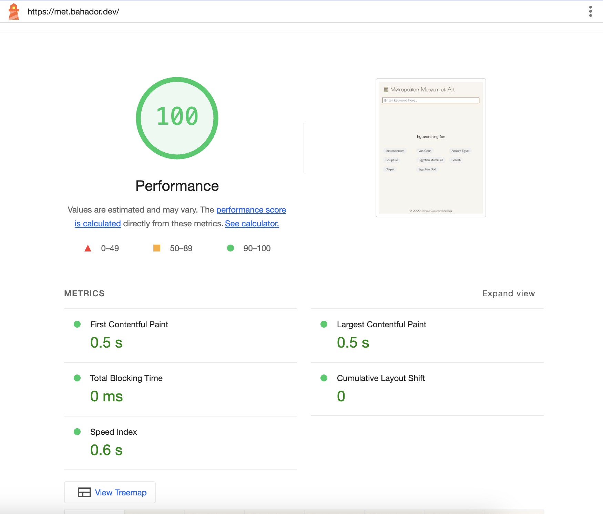

# Metropolitan Museum of Art Experience

This project creates a simplified user experience for exploring the Metropolitan Museum of Art collection using their [public API](https://metmuseum.github.io/). It demonstrates techniques for efficiently scrolling through thousands of artifacts without compromising performance.

Try the live app: [Met Museum React Experience](https://bahaaador.github.io/met-museum-react/)

## Key Features

- Infinite scrolling through thousands of artifacts
- Lazy loading of images and artifact information
- Smooth animations with `react-spring`
- Responsive design using CSS Grid and Flexbox
- Performance optimizations with Intersection Observer API and React Suspense
- Efficient state management using Zustand
- Accessibility considerations for screen readers and reduced motion preferences

## Performance Highlights

The app achieves high performance scores across various metrics:

Key optimizations include:
- Intersection Observer API for efficient rendering and image loading
- React Suspense for component loading and code splitting
- AbortSignal API to cancel ongoing requests during user interactions

## Accessibility

Accessibility is a core focus of this project:

- High accessibility score on Google's Lighthouse evaluation
- Screen reader friendly, verified with the Axe accessibility tool
- Respects user's reduced motion preferences

## Tech Stack

- React
- Vite for fast development and building
- pnpm for efficient package management
- Zustand for state management
- React Spring for smooth animations
- CSS Grid and Flexbox for responsive layouts
- ESLint and Prettier for code quality
- Vitest for testing

## Development

To get started with development:

1. Clone the repository
2. Install dependencies: `pnpm install`
3. Start the dev server: `pnpm dev`

### Available Scripts

- `pnpm dev`: Run the app in development mode
- `pnpm build`: Build the app for production
- `pnpm preview`: Preview the production build locally
- `pnpm test`: Run the test suite with Vitest
- `pnpm lint`: Check for code quality issues with ESLint
- `pnpm format`: Auto-format code with Prettier

## Deployment

This project uses GitHub Actions for continuous deployment. On push to the master branch, it automatically builds and deploys to GitHub Pages.

For deployment details, see [.github/workflows/deploy.yml](.github/workflows/deploy.yml).

## Notes

During the development of this project, I faced several interesting challenges:

1. Optimizing the infinite scroll for thousands of items without sacrificing performance.
2. Implementing a smooth, accessible user experience that respects user preferences.
3. Balancing between immediate responsiveness and efficient API usage.
